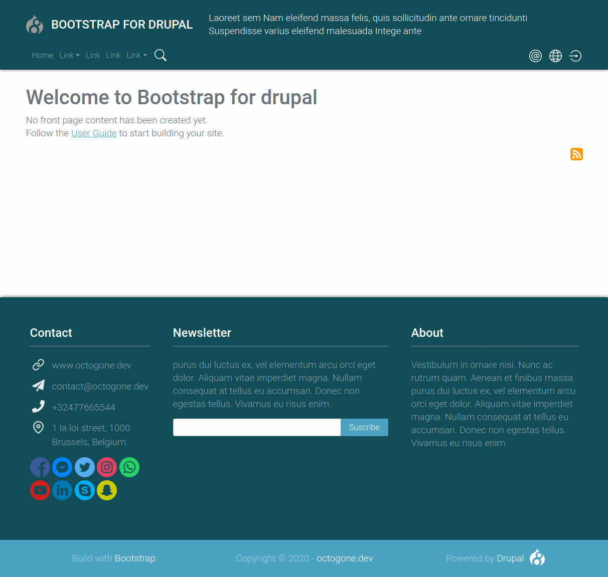
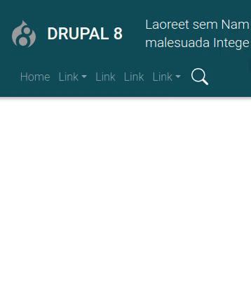
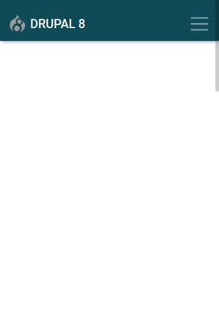

BOOTSTRAP FOR DRUPAL
---------------

CONTENTS OF THIS FILE
---------------

 * INTRODUCTION
 * NOTES
 * FEATURES
 * INSTALLATION
 * CONFIGURATION
 * BETTER ADMINISTRATION EXPERIENCE
 * MODULES SUGGESTION
 * FOR DEVELOPERS
 * FUTUR DEVELOPMENTS
 * REQUIREMENTS

INTRODUCTION
----------

This theme provides a base Bootstrap 4 solution for Drupal 8 with an advanced
 navigation for desktop and mobile.

This theme wants to provide to users **the best experience out of the box**,
right after a Drupal installation: All native Drupal block and menu are placed
 and stylized after installation as well all of the native pages and forms.
 The website is directly usable after instalation.

It is also a good bootstrap 4 base solution for developers with SCSS files
 provided.

! ! Please contribute and
 [buy me a coffee](https://www.buymeacoffee.com/octogonedev) ! !

This theme is created by [OCTOGONE.DEV](http://www.octogone.dev)

## SCREENSHOT


NOTES
--
* Windows Edge V18 is not supported (it doesn’t support **mask** CSS properties)
, only Edge +V79 is supported.
* Bootstrap Tooltips, popover and modal might not work when logged in
* This version is build with  Bootstrap v4.4.1

## COMPARAISON WITH OTHER MAJOR BOOTSTRAP BASED THEME

### BOOTSTRAP THEME
[bootstrap](https://www.drupal.org/project/bootstrap) is based on Bootstrap 3,
this theme on bootstrap 4. It doesn't propose a "out of the box" solution like
this theme does.

## BARRIO THEME
[Barrio](https://www.drupal.org/project/bootstrap_barrio) propose a
sophisticated configuration of Bootstrap **components/layout**
 and **color/font** in the theme configuration. This can be out of scope for
 normal users and also a constraint for developpers who want to have full
 control on the front end developement with the twig template and SCSS files
 like this theme proposed. It doesn't propose a "out of the box" solution
 like this theme does.

FEATURES
-----

## ADVANCED NAVIGATION:
 - dynamic search bar
 - Animated dropdown
 - Admin Toolbar compatible
 - mobile menu with smooth opening
 - Icon for: user menu, contact, language menu
 - Language menu with flag (fr, en, es, de, nl, it, pt-pt, pt-br, ru)

 Desktop Menu            |  Mobile menu
:-------------------------:|:-------------------------:
 | 

## OTHERS
* Responsive branding header with Logo, slogan and site name
* Responsive footer and sub footer with 3 regions for each
* Aside content sticky with icon
* All native page are stylized
* Comments are fully stylized
* All forms are stylized
* Print version

INSTALLATION
-----------
Extract this theme folder into **/themes/contrib** of your
 [Drupal 8 installation](https://www.drupal.org/docs/8/install) and go
  to `/admin/appearance/settings` to set it as **default theme**.

CONFIGURATION
---------

All native Drupal block and menu are placed and stylized right after
installation and the website is directly usable. You just have to create
 the content!

## LOGO
  The maximum height of the logo in the header is **40px**. To change the logo
  go to `/admin/appearance/settings/bootstrap_for_drupal` and un-tick
  **Use the logo supplied by the theme** to upload yours.

## SLOGAN
  The maximum length of the slogan is 256 characters

## MAIN NAVIGATION
1. Create menu items in the main navigation go
to `/admin/structure/menu/manage/main`.
2. Ceate a dropdown menu, you have to create a child menu item, for that
 hold/slide the cross of a menu item to the right.
  **Only one level is supported**.

**Note:** You don’t have to check **show as expanded** for the parent links,
this is automatic. The first level link (the parent) will not be used,
Bootstrap make it the dropdown trigger automaticaly. Thus put in that link
the target **#** - for exemple.

## MULTILINGUAL MENU
  To activate the language menu, go to the module page `/admin/modules` and
  activate the **language module** in the multilingual section. Go to
  `/admin/config/regional/language` to add a language. The language menu will
  automatically be added to the main navigation after the module activation
  and the menu populated with the proper flags.
  **Configured language icons** : en, fr, de, it, es, nl, ru, pt-pt, pt-br.

## LIST OF CONTACT TYPE (MAIL, PHONE, ETC..)
  The first footer region is configured to contain a **list of contact type**
  (mail, phone, etc..), it will automatically add icon to a list (ul). You have
   the possibility to copy the code provided from the folder **HTML**, or
   create a list yourself.

  Order of the links:
  * Link
  * Email
  * Phone
  * Address

###  CREATE AND PLACE THE CUSTOM BLOCK
  1. Create a block at `/admin/structure/block/block-content`
  2. Place the block at `/admin/structure/block` in the region
   **Footer - left box**.

## SOCIAL ICON
   Social icon HTML code (svg) is provided in the folder **HTML** of this theme.

## BOOTSTRAP MODAL
  Modal code is available in folder **HTML** of this theme. Copy the
  **modal box** code in a custom block that you create with full html text
  format, and place the created block in the **modal region**, specify the page
   where it display in the block seetings, DONT display the title of the block.
    Finaly, in a page copy the **button modal** code.

CREATE CONTENT
-----
Visit the page [Administering a Drupal 8 site](https://www.drupal.org/docs/8/administering-a-drupal-8-site/managing-content) for more information. Note that
the **text in the summary field** is the text used by the home page to list content.

BETTER ADMINISTRATION EXPERIENCE
-----------------------

The **adminimal suite** is the ultimate administration theming solution for
Drupal, you just have to activate the modules to make it work!  It makes the
usage of Drupal admin interface much more user friendly. This theme is
compatible with the Admin toolbar, the sticky bar will position properly
when one or both of the admin bar are active, in desktop or mobile screen.
Go to `/admin/appearance` and in the **Administration theme** (end of the page)
 choose adminimal.

**List of module to install:**

* [Admin Toolbar](https://www.drupal.org/project/admin_toolbar)
* [Adminimal Admin Toolbar](https://www.drupal.org/project/adminimal_admin_toolbar)
* [Adminimal theme](https://www.drupal.org/project/adminimal_theme)

MODULES SUGGESTION
-------------

This is a list of simple module allowing you to greatly enhance the drupal
 usage experience.

## PATHAUTO

[pathauto](https://www.drupal.org/project/pathauto) will automatically generates
 URL/path aliases for various kinds of content.

## FORM PLACEHOLDER
  [form_placeholder](https://www.drupal.org/project/form_placeholder)
  This module transforms the forms labels into placeholder. It makes the form
  much clearer
  and user friendly.

  This is the list of ID to add in the text area **Include text fields matching the
  pattern** of the config page `/admin/config/user-interface/form-placeholder`:
  ```
  #edit-mail
  #edit-message-0-value
  #edit-name
  #edit-subject-0-value
  #edit-pass
  ```
## HONEYPOT
  [honeypot](https://www.drupal.org/project/honeypot)
  protect your form from spam without punishing the user with a captcha.

## REDIRECT AFTER LOGIN
  [redirect_after_login](https://www.drupal.org/project/redirect_after_login)
  is a simple module allowing you to change the redirection to the user page
   after login.

## RESPONSIVE FAVICONS
  [responsive_favicons](https://www.drupal.org/project/responsive_favicons)
  allow you to easily integrate in Drupal the favicons bundle generated at [realfavicongenerator.net](http://realfavicongenerator.net/).

FOR DEVELOPERS
---------

 * All SCSS file are provided
 * Custom bootstrap variable overwrite SCSS file
 * Only SVG icon with mask attribute is used, allowing :
 color/size/position/transition with CSS. Note that **mask** CSS properties is
 not supported by Edge V18. No use of icon framework
 ( like fontawesome - weight 2MB), all svg icon are local, thus lighter
 (60kb in total).
 * Maximum bootstrap integration into the theme
 * Gulp file is provided and SCCS files are configured to be build with node.js

## BOOTSTRAP 4 FEATURES
  The theme is totally build with bootstrap grid system and maximum usage of
  bootstrap class.

  List of Bootstrap components integrated  :
  * status message
  * pager
  * breadcrumbs
  * tooltips / popover / modal /carousel (check javascript for target)
  * form (custom style) : submit, input, checkbox, select, radio, textfield

FUTUR DEVELOPEMENT
-------------

* Multi color / font combination in the theme configuration with one click
 (in same layout).
* Drupal 9 porting
* Payd theme with more features:
  - Complete list of HTML typography elements stylized in a template page
  - Static and dynamic bootstrap components with one click copy code
  - Static and dynamic custom components with one click copy code
  - Dynamic scrollspy with auto-generated menu (javascript)
  - Top / down Scrool button (javascript)
  - 2 more animations effect for the search bar
  - Page that list all bootstrap class
  - All Drupal language / flag supported for the language selection menu

REQUIREMENTS
--------

no requirements
